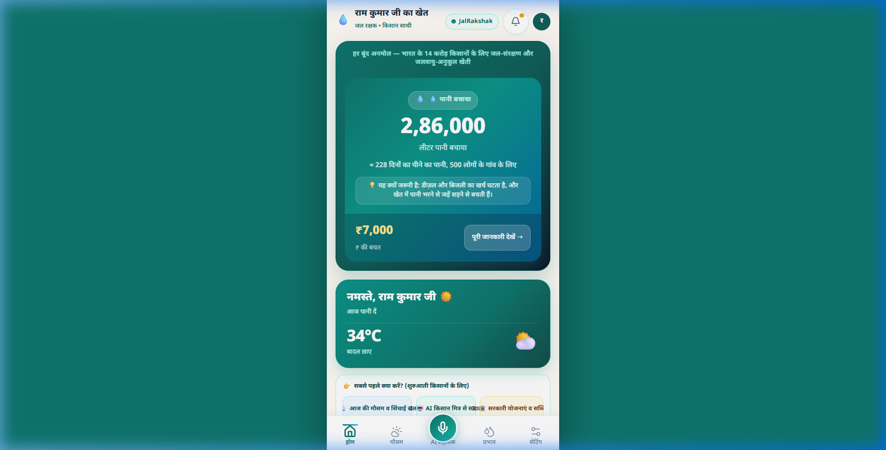
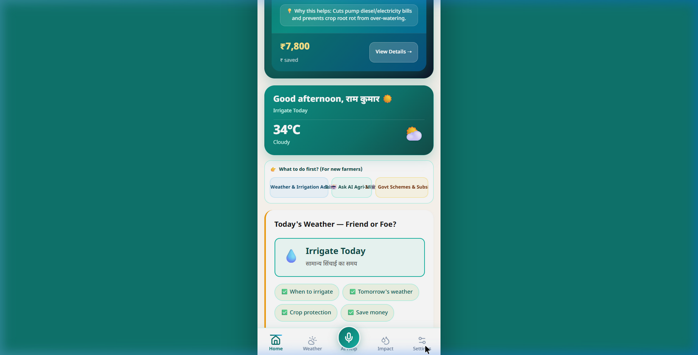
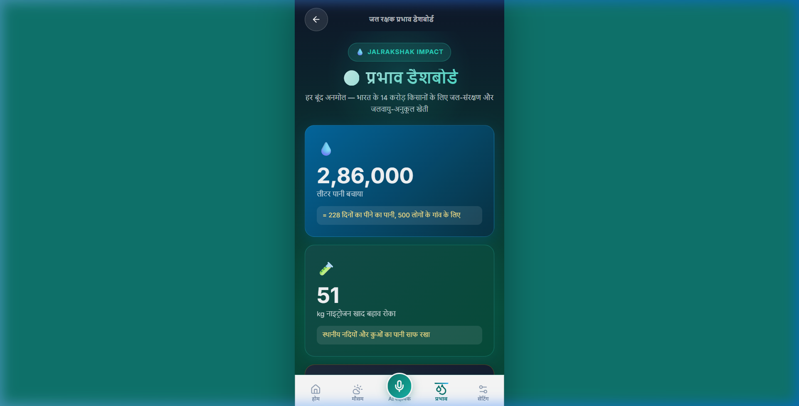
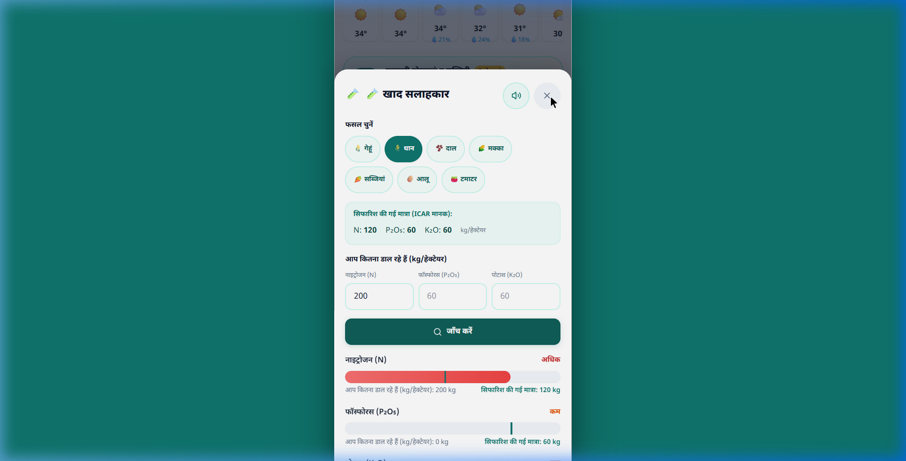
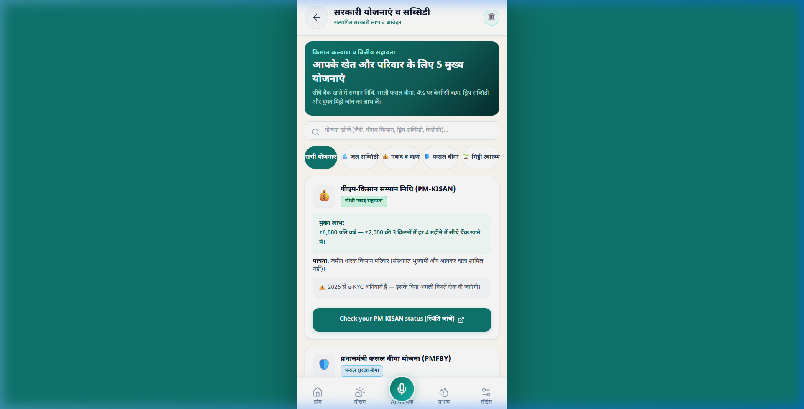

# 💧 JalRakshak (जल रक्षक) — जल और मिट्टी का रक्षक

<div align="center">

[](https://github.com/MSAbhishek22/JalRakshak/actions)
[](https://github.com/MSAbhishek22/JalRakshak/actions)
[](https://jalrakshak-amber.vercel.app)
[](LICENSE)
[](#-5-languages-supported)

**AI-powered water-and-soil guardian for India's 140 million smallholder farmers.**  
**Works in Hindi, Bengali, Marathi, Punjabi & English. Offline-capable. Free.**

[🌐 Live Application](https://jalrakshak-amber.vercel.app) • [📱 Interactive Demo](https://jalrakshak-amber.vercel.app/?demo=true) • [📋 Play Store Listing](PLAY_STORE_LISTING.md)

</div>

---

## 🌧️ The Crisis in India's Fields

Every cropping cycle, **140 million small and marginal farmers** across India face critical decisions with generational tools that no longer match erratic climate realities:

> *"क्या आज पानी देना चाहिए?" — Should I irrigate today?*  
> *"क्या कल बारिश आएगी?" — Will it rain tomorrow?*  
> *"कितनी खाद डालनी है?" — How much fertilizer does this crop actually need?*

Miscalculating these decisions has immediate, severe costs:
- **Groundwater Depletion & Pumping Cost**: Surface flooding often wastes 40–50% of applied water. Running diesel pumps unnecessarily burns ₹450–₹750 per cycle (~₹500 on average for a 1-hectare plot), draining both farmer finances and sinking regional aquifers.
- **Fertilizer Runoff & Soil Degradation**: Without accessible dosage guidance, over-application of nitrogen (urea) acidifies soil, wastes cash, and leaches nitrates into village drinking water wells.
- **Inaccessible Subsidies**: While government schemes offer up to 55% subsidies for drip irrigation (PMKSY) or ₹6,000 annual cash assistance (PM-KISAN), smallholders frequently miss deadlines, lose benefits to missing e-KYC, or don't know where to apply.

Existing agricultural portals are often text-dense, English-first, and desktop-oriented. **JalRakshak** is built to bridge this gap directly on the farmer's mobile screen in their own mother tongue.

---

## 📜 Project History — From Monsoon Mitra to JalRakshak

This platform builds directly on an earlier pilot project originally named **Monsoon Mitra** (मानसून मित्र) — an early hackathon prototype focused specifically on monsoon rain forecasting, voice AI advisory, and weather-driven irrigation decisions, which entered early pilot and NGO partnership discussions.

During this evolution, the platform was substantially expanded from a seasonal monsoon helper into **JalRakshak (जल रक्षक)** — a year-round water and soil guardian. Key enhancements include:
1. **Water-Conservation Reframing**: Elevated water conservation to the primary headline metric, computing exact liters conserved (~22,000 L per skipped cycle for a 1-hectare plot) alongside relatable community equivalents (e.g. days of village drinking water).
2. **Fertilizer Advisory Module**: Dynamic ICAR-standard N-P-K nutrient balancing tool with instant overdose alerts to curb chemical waste and protect groundwater.
3. **Government Schemes & Subsidies Module**: Curated directory of verified central agricultural welfare programs with direct portal links, eligibility criteria, and critical alerts (such as the 2026 mandatory e-KYC requirement).
4. **Comprehensive UI/UX Rebuild**: Modernized design system centered on deep teal (`#0F766E`), sky blue (`#38BDF8`), and saffron (`#F59E0B`), with full keyboard and mobile touch accessibility.

The complete git commit history — from the initial commit through the original pilot and up to the current production release — is preserved in this repository.

---

## 💡 What JalRakshak Does

JalRakshak is an offline-capable **Progressive Web App (PWA)** engineered for affordable Android devices, operating in low-connectivity rural environments:

| Feature | What It Does | Real Code Metric / Constant |
|:---|:---|:---|
| 💧 **Smart Irrigation Advisor** | Analyzes 24h & 7-day precipitation probabilities, humidity, and temperature to recommend irrigating or skipping. | Saves ~22,000 Liters & ₹450–₹750 per avoided cycle (`WATER_PER_CYCLE_LITERS = 22000`) |
| 🧪 **Fertilizer Advisory** | Crop-specific N-P-K nutrient balancing based on ICAR standards; alerts against nitrogen over-application. | Wheat: 120-60-40, Rice: 120-60-60, Pulses: 20-40-20 kg/ha |
| 📊 **Water & Eco Impact Dashboard** | Quantifies total water conserved, money saved, diesel runtime spared, and CO₂ emissions avoided. | Relatable equivalent: `= X days of drinking water for a 500-person village` (WHO 2.5 L/day) |
| 🏛️ **Government Schemes Portal** | Real-time directory of 5 major farmer welfare and subsidy programs with official application links. | Subsidies up to 55% for drip irrigation; 4% subsidized farm credit |
| 🌦️ **Hyperlocal Weather** | 7-day forecast with hourly rain probability curves, temperature, and wind from Open-Meteo. | 100% free, hyperlocal, zero authentication required |
| 🤖 **Multilingual AI Kisan Sahayak** | Voice-first farming assistant answering crop pest, disease, and soil queries via Gemini 1.5 Flash. | Real-time speech input & synthesis, zero API keys exposed to browser |
| 🏪 **Mandi Market Rates** | APMC daily mandi price tracker with MSP benchmarks for Wheat, Rice, Cotton, and Maize. | Daily price trends and variance indicators |
| 🌾 **Community Farmer Wisdom** | Verified peer-to-peer practical agricultural tips with community upvoting. | Practical localized water harvesting & mulching techniques |
| 🌍 **5 Indian Languages** | Native translations with fallback resilience in Hindi, Bengali, Marathi, Punjabi, and English. | 100% UI localized across all 5 languages |

---

## 📱 Visual Walkthrough

Authentic user interface captures from the live deployed application ([jalrakshak-amber.vercel.app](https://jalrakshak-amber.vercel.app/?demo=true)):

<div align="center">

### 1. Home Dashboard & Water Conservation Hero (Hindi & English)

| Hindi Interface (हिन्दी) | English Interface |
|:---:|:---:|
|  |  |
| *Hero Water Saved counter (2,86,000 L), today's decision, and quick action cards* | *Localized English view with identical real-time savings & weather metrics* |

---

### 2. Impact Dashboard & Fertilizer Advisory

| Community Impact Dashboard | Fertilizer (NPK) Dosage Verification |
|:---:|:---:|
|  |  |
| *2,86,000 L saved = 228 days drinking water for 500 people, 51 kg N runoff prevented* | *ICAR standard check detecting nitrogen overdose (200 kg vs 120 kg recommended)* |

---

### 3. Government Schemes & Subsidies Directory

| Verified Schemes & Subsidies Directory |
|:---:|
|  |
| *Interactive category filter chips, search bar, and direct official government portal links* |

</div>

---

## 🏛️ Verified Government Schemes Directory

All scheme figures embedded within JalRakshak are cross-referenced with official Ministry of Agriculture & Farmers Welfare guidelines (`src/data/schemesData.js`):

| Scheme Name | Key Benefit & Financial Allocation | Eligibility Criteria | Critical Note | Official Portal |
|:---|:---|:---|:---|:---:|
| **PM-KISAN** (प्रधानमंत्री किसान सम्मान निधि) | **₹6,000 per year** in 3 equal installments of ₹2,000 directly transferred to bank account | Landholding farmer families across India | ⚠️ **e-KYC mandatory** to prevent installment hold | [pmkisan.gov.in](https://pmkisan.gov.in) |
| **PMKSY Micro-Irrigation** (पीएम कृषि सिंचाई योजना) | **Up to 55% subsidy** on drip and sprinkler irrigation systems | All farmers with cultivable land and reliable water source | 💧 Saves 40–50% water, boosts yield 20–30% | [pmksy.gov.in](https://pmksy.gov.in) |
| **PMFBY** (प्रधानमंत्री फसल बीमा योजना) | Maximum premium **2% for Kharif, 1.5% for Rabi, 5% for commercial/horticultural** crops | All farmers growing notified crops in notified areas | 🛡️ Covers prevented sowing, mid-season adversity & post-harvest loss | [pmfby.gov.in](https://pmfby.gov.in) |
| **Kisan Credit Card (KCC)** | Subsidized crop loans up to **₹3 Lakh at ~4% effective interest** rate | All farmers, tenant farmers, and sharecroppers | 🏦 Collateral-free credit up to ₹1.60 Lakh | [myscheme.gov.in](https://www.myscheme.gov.in/schemes/kcc) |
| **Soil Health Card** (मृदा स्वास्थ्य कार्ड) | **Free testing** of 12 soil parameters (N, P, K, S, Zn, Fe, Cu, Mn, Bo, pH, EC, OC) | All farmers; cycle renewed every 3 years | 🌱 Typical fertilizer cost savings of ₹1,500–₹3,000/acre | [soilhealth.dac.gov.in](https://soilhealth.dac.gov.in) |

---

## 🔬 Computational Logic & Scientific Derivations

The savings computations in `src/utils/savingsCalculator.js` are grounded in standard agricultural engineering metrics:

1. **Water Saved per Skipped Cycle**:
   $$\text{Water Saved} = 22,000\text{ Liters per 1-hectare cycle}$$
   *Derivation*: Surface flood irrigation in semi-arid zones uses approximately 8,000–10,000 liters/acre per depth cycle. For 1 hectare (2.47 acres), one avoided cycle conserves ~22,000 liters.

2. **Rupee Savings**:
   $$\text{Cost} = \text{Crop Specific Constant (₹450 for Wheat, ₹650 for Rice, ₹750 for Vegetables)}$$
   Accounts for diesel/electricity consumption and pump maintenance during one complete irrigation round.

3. **Village Drinking Water Relatable Equivalent**:
   $$\text{Drinking Days} = \left\lfloor \frac{\text{Liters Saved}}{500 \times 2.5\text{ Liters}} \right\rfloor$$
   Based on the World Health Organization (WHO) baseline survival standard of 2.5 liters of drinking water per person per day.

4. **CO₂ Emission Abatement**:
   $$\text{CO}_2\text{ Prevented} = 11.47\text{ kg per cycle}$$
   A standard 5 HP diesel pump delivers ~18,000 L/hour consuming ~3.5 L diesel/hour. Pumping 22,000 L takes 1.22 hours = 4.28 L diesel. At the IPCC factor of 2.68 kg CO₂/liter diesel, avoiding one cycle prevents 11.47 kg CO₂.

---

## 🏗️ Architecture & Technology Stack

```
                                 [Farmer's Mobile Device]
                               (PWA / Responsive React SPA)
                                            │
        ┌───────────────────────────────────┼───────────────────────────────────┐
        ▼                                   ▼                                   ▼
[Open-Meteo API]                  [Vercel Serverless]                    [Firebase]
Hyperlocal Weather & Rain         /api/chat Proxy Endpoint               Cloud Messaging
Zero-key, Instant CDN             Rate Limited • Zero Key Leak           Push Disaster Alerts
        │                                   │                                   │
        ▼                                   ▼                                   ▼
Hourly precipitation &            [Google Gemini 1.5 Flash]              Offline Storage
temperature vectors               Context-aware Agri AI                  localStorage / SW Cache
```

| Layer | Technology | Key Implementation Details |
|:---|:---|:---|
| **Core Framework** | React 18 + Vite 5 | Micro-bundle architecture; fast startup on sub-₹8,000 Android devices |
| **Design System** | Tailwind CSS 3 | Deep Teal (`#0F766E`), Sky Aqua (`#38BDF8`), Saffron (`#F59E0B`) |
| **Iconography & Motion** | Lucide React + Framer Motion | Smooth state transitions, accessible tap targets (min 48×48px) |
| **AI Processing** | Google Gemini 1.5 Flash | Server-proxied `/api/chat` with rate limiting and prompt safety guards |
| **Weather Engine** | Open-Meteo API | Coordinates-based real-time forecast without external credential requirements |
| **Offline & PWA** | Service Worker + Web App Manifest | Standalone homescreen installation, offline fallback screen |
| **Testing** | Vitest + React Testing Library + MSW | 21 automated unit and integration tests |

---

## 🔒 Security & Privacy Posture

- **Zero Client-Side Secrets**: `GEMINI_API_KEY` is strictly server-side. The frontend bundle contains zero LLM credentials.
- **Serverless Protection**: All AI queries route through `/api/chat` which enforces:
  - Rate limiting (10 requests/minute per client IP)
  - Input sanitization (HTML stripped, 800-character ceiling)
  - Strict system instructions preventing prompt injection
- **Zero PII Storage**: JalRakshak never requests, logs, or stores Aadhaar numbers, phone numbers, or bank credentials. All farm parameters remain stored in device `localStorage`.
- **Security Headers**: Production deployment enforces Content Security Policy (CSP), HSTS, `X-Content-Type-Options: nosniff`, and `X-Frame-Options: DENY`.

---

## 🚀 Getting Started (Developers)

### Prerequisites
- Node.js 18.x or higher
- npm 9.x or higher

### Local Setup

```bash
# 1. Clone the repository with full commit history
git clone https://github.com/MSAbhishek22/JalRakshak.git
cd JalRakshak

# 2. Install dependencies
npm install

# 3. Configure environment variables
cp .env.example .env.local

# Edit .env.local and insert your Gemini API Key:
# GEMINI_API_KEY=your_google_gemini_api_key_here

# 4. Start local development server
npm run dev
```

Visit `http://localhost:5173` to explore the application locally.  
To view the pre-filled demo state, navigate to `http://localhost:5173/?demo=true`.

### Automated Verification & Quality Checks

```bash
# Run all unit and component tests
npm run test:run

# Generate test coverage report
npm run test:coverage

# Run ESLint linter
npm run lint

# Build production bundle
npm run build
```

---

## 👥 Core Contributors

Built with shared commitment to India's agricultural future:

- **MS Abhishek** — [GitHub (@MSAbhishek22)](https://github.com/MSAbhishek22) • `msabhishekanni10@gmail.com`
- **Aayushi Goel** — `aayushigoel73@gmail.com`

---

## 📄 License

This project is licensed under the **MIT License** — open and free for farmers, developers, and agricultural organizations worldwide.

<div align="center">
<strong>💧 जल और मिट्टी का रक्षक — Built for the hands that feed the nation. 🌾</strong>
</div>
